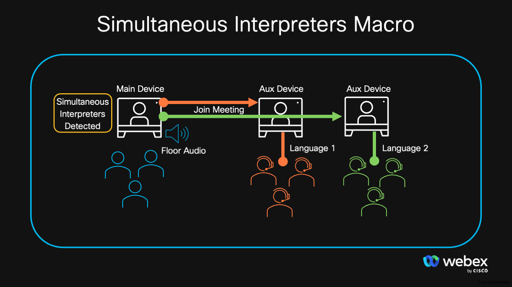

# Simultaneous Interpreters Macro

Example macro which adds Auxiliary Webex Devices to a Webex Meeting when the Main Device detects Simultaneous Interpreters are present. Once the Auxiliary Device join the meeting, the macro automatically selects a preconfigured specific Simultaneous Interpreters audio language.

This is useful for when you want to output the Simultaneous Interpreters audio to separate in room audio headsets and keep the main device outputting the floor audio for the meeting.

## Overview

When the main device joins a Webex Meeting and detects there are Simultaneous Interpreters, it will share the Webex Meeting information to the configured Auxiliary devices for them to join the same meeting.

If the main device happens to Participant Add capabilities, the macro will instead try to add the Aux devices using this approach.

Once the Auxiliary devices join the meeting, they too will check which Simultaneous Interpreters are available. If the macro identify the language channel they have been assigned in the macros config, it will select that language and set the mixer level to 100%.

## Setup

### Prerequisites & Dependencies: 

- Two or more Webex Devices running RoomOS 11.16 or greater
- Web admin access to the device to upload the macro.

### Installation Steps:
1. Download the ``simultaneouse-interpreters.js`` file and upload it to your Webex Room devices Macro editor via the web interface.
2. Configure the Macro by changing the initial values, there are comments explaining each one.
3. Enable the Macro on the editor.
    
    
    
## Demo

<!-- Keep the following statement -->
*For more demos & PoCs like this, check out our [Webex Labs site](https://collabtoolbox.cisco.com/webex-labs).

## License
All contents are licensed under the MIT license. Please see [license](LICENSE) for details.

## Disclaimer

 Everything included is for demo and Proof of Concept purposes only. Use of the site is solely at your own risk. This site may contain links to third party content, which we do not warrant, endorse, or assume liability for. These demos are for Cisco Webex use cases, but are not Official Cisco Webex Branded demos.

## Questions
Please contact the WXSD team at [wxsd@external.cisco.com](mailto:wxsd@external.cisco.com?subject=simultaneous-interpreters-macro) for questions. Or, if you're a Cisco internal employee, reach out to us on the Webex App via our bot (globalexpert@webex.bot). In the "Engagement Type" field, choose the "API/SDK Proof of Concept Integration Development" option to make sure you reach our team. 
